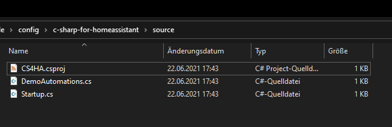
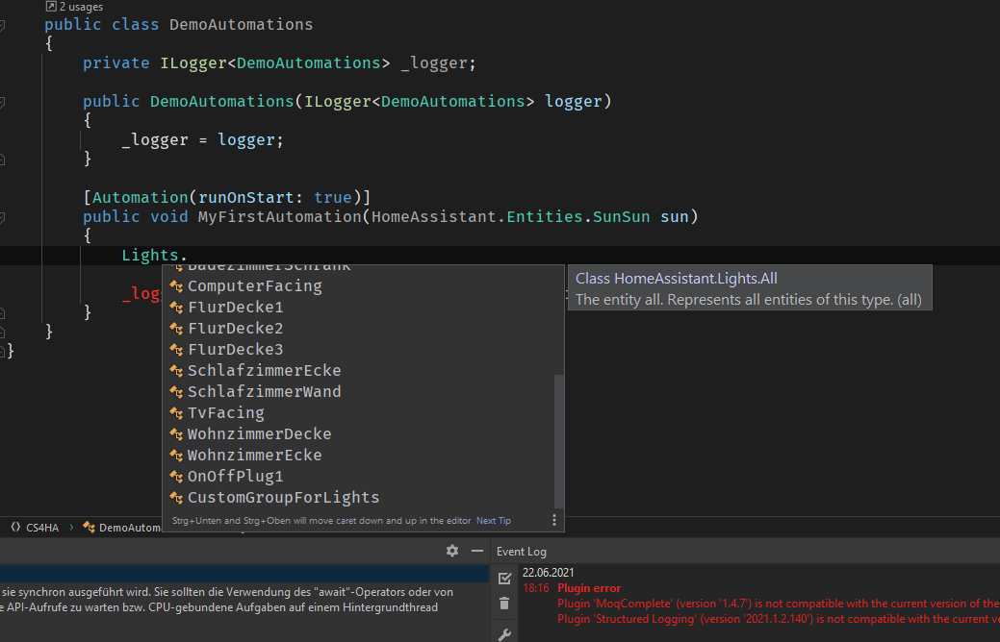

# C# for Home Assistant

## How to install
1. Add `https://github.com/anhaehne/hhnl.HomeAssistantNet` to your repositories under `Supervisor > Add-on Store > 3 dots top right > Repositories`
2. Click the Add-on named `C#` and install it. (This can currently take some time since the application is build during this process. Later releases will inlcude a pre build application.)
3. Start the Add-on
4. You have to make your config folder accessable. This can be achieved with a network share. An `Samba share` Add-on is available in the Add-on Store. 

## Write you first automtation

Open the project source folder in the config folder `\\<your-homeassistant-host>\config\c-sharp-for-homeassistant\source\`. If the folder doesn't exist make sure you have started the Add-on. 

Some IDE's have trouble opening repositories from a network path. In windows you can mount the path as network drive as a workaround.

To develop locally we have to provide the Home Assistant hostname/ip, an access token and the supervisor endpoint (This is not the Home Assistant Supervisor). To not store these in plain text we can use [UserSecrets](https://docs.microsoft.com/en-us/aspnet/core/security/app-secrets?view=aspnetcore-5.0&tabs=windows). The project file already contains a UserSecretsId so we can just add the secrets. Open a command prompt in that folder and execute the following commands:

`dotnet user-secrets set "HOME_ASSISTANT_API" "http://<home-assistant-ip>:8123/"`

`dotnet user-secrets set "SUPERVISOR_TOKEN" "<you-access-token>"`

`dotnet user-secrets set "SupervisorUrl" "http://<home-assistant-ip>:20777"`

If you now open the project and build for the first time, the Home Assistant entities are fetched and classes generated.

If this didn't work, check your build output for errors.